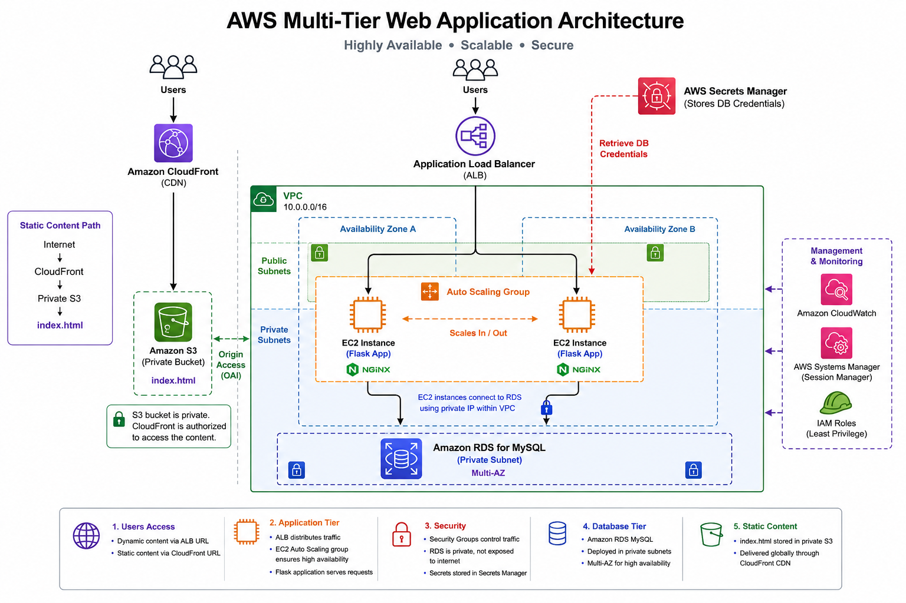

# aws-multitier-webapp

# AWS Multi-Tier Web Application

A hands-on AWS project demonstrating a highly available multi-tier web architecture using **Application Load Balancer, EC2 Auto Scaling, Amazon RDS, AWS Secrets Manager, Amazon S3, and Amazon CloudFront**.

The project was built to gain practical experience designing, deploying, securing, scaling, and updating an application architecture on AWS.

---

## Architecture

The application uses a highly available multi-tier AWS architecture with public-facing load balancing, auto-scaled application servers, a private database tier, and CloudFront-backed static content delivery.

---

## AWS Services Used

| AWS Service | Purpose |
|---|---|
| Amazon VPC | Provides network isolation for application resources |
| Application Load Balancer (ALB) | Distributes incoming application traffic across EC2 instances |
| Amazon EC2 | Hosts the Python Flask application |
| EC2 Auto Scaling | Maintains application capacity and availability |
| EC2 Launch Templates | Provides repeatable EC2 instance configuration |
| Amazon RDS MySQL | Provides the private relational database tier |
| AWS Secrets Manager | Securely stores and retrieves database credentials |
| AWS IAM | Provides EC2 permissions using IAM roles |
| AWS Systems Manager | Provides administrative access through Session Manager |
| Amazon S3 | Stores static web content |
| Amazon CloudFront | Delivers private S3 content through a global CDN |
| Amazon CloudWatch | Provides monitoring integration |

## Application Architecture

The project contains two web content paths:

1. **Dynamic application:** ALB → EC2 Auto Scaling → Flask → RDS
2. **Static content:** CloudFront → Private S3

### Dynamic Application Flow

User
  |
  v
Application Load Balancer
  |
  v
Target Group
  |
  v
EC2 Auto Scaling Group
  |
  v
Flask Application
  |
  +--------> AWS Secrets Manager
  |              |
  |        DB Credentials
  |
  v
Amazon RDS MySQL

The Application Load Balancer distributes incoming requests across healthy EC2 instances in the Auto Scaling group.

The Flask application running on EC2 connects to the private RDS MySQL database.

Database credentials are retrieved from **AWS Secrets Manager** using the IAM role attached to the EC2 instances instead of storing the database password directly in the application code.

---

## Static Content Delivery

Static web content is stored in an Amazon S3 bucket and delivered using Amazon CloudFront.

User
  |
  v
Amazon CloudFront
  |
  v
Private Amazon S3 Bucket
  |
  v
index.html

The S3 bucket remains private.

CloudFront is granted access to the S3 origin, allowing users to retrieve the static content through CloudFront without exposing the S3 bucket publicly.

The CloudFront distribution uses:

index.html

as the **Default Root Object**, allowing the CloudFront distribution URL to load the home page directly.

---

## High Availability and Auto Scaling

The application tier uses:

- Application Load Balancer
- Multiple EC2 instances
- EC2 Auto Scaling Group
- Target group health checks
- EC2 Launch Template

The ALB distributes incoming requests between healthy application instances.

The Auto Scaling group maintains the desired number of EC2 instances and can replace unhealthy instances when required.

Because requests are distributed across multiple EC2 instances, the application does not depend on a single application server.

---

## Private Database Tier

Amazon RDS MySQL is used as the database tier.

The database is not accessed directly by internet users.

Application EC2 instances communicate with the RDS database using controlled security group rules.

Internet
   X
   |
   | No direct DB access
   |
  RDS

EC2 Application
      |
      | MySQL
      v
     RDS

This separates the application and database tiers and reduces unnecessary exposure of the database.

---

## Secure Credential Management

Database credentials are stored in **AWS Secrets Manager**.

The EC2 instances use an IAM role that allows the application to retrieve the required secret.

EC2 Flask Application
        |
        | IAM Role
        v
AWS Secrets Manager
        |
        | username/password
        v
Amazon RDS

This approach avoids hard-coding database passwords directly inside the application source code.

---

## EC2 Management with AWS Systems Manager

EC2 instances were administered using **AWS Systems Manager Session Manager**.

The EC2 IAM instance role contains the permissions required for Systems Manager.

This allowed the application instances to be accessed and managed without depending on direct SSH access during the lab workflow.

---

## Launch Templates

An EC2 Launch Template defines the configuration used when the Auto Scaling group launches new instances.

The template includes configuration such as:

- Amazon Machine Image (AMI)
- EC2 instance type
- Security group
- IAM instance profile
- User data bootstrap configuration

This provides a consistent configuration whenever Auto Scaling launches replacement or additional instances.

---

## Rolling Updates with Instance Refresh

The application configuration was updated by creating a new version of the EC2 Launch Template.

The newer Launch Template version included the updated Flask application configuration.

The Auto Scaling group was then updated using **Instance Refresh**.

Launch Template v1
       |
       | Create new version
       v
Launch Template v2
       |
       v
Auto Scaling Instance Refresh
       |
       +------> Replace EC2 #1
       |
       +------> Replace EC2 #2
       |
       v
Updated Application Fleet

This demonstrated a rolling infrastructure update rather than manually modifying each EC2 instance.

The Instance Refresh completed successfully and the replacement instances served the application through the ALB.

---

## CloudFront with Private S3

Amazon S3 stores the static website content.

Instead of making the S3 bucket public, CloudFront is authorized to retrieve content from the private S3 origin.

Internet User
      |
      v
  CloudFront
      |
      | Authorized origin access
      v
 Private S3
      |
      v
  index.html

This allows CloudFront to act as the public content delivery layer while the S3 bucket remains private.

---

## Security Design

The project demonstrates several AWS security practices:

- RDS is not directly exposed to internet users
- S3 static content bucket remains private
- CloudFront provides access to private S3 content
- Database credentials are stored in AWS Secrets Manager
- EC2 uses IAM roles instead of embedded AWS credentials
- Security groups control communication between application components
- Systems Manager Session Manager is used for EC2 administration
- Application and database responsibilities are separated into different tiers

---

## Key Concepts Demonstrated

- Multi-tier AWS architecture
- High availability
- Load balancing
- EC2 Auto Scaling
- Target group health checks
- EC2 Launch Templates
- Rolling Instance Refresh
- Flask application deployment
- Private RDS connectivity
- IAM roles
- AWS Secrets Manager integration
- Systems Manager Session Manager
- Security group based access control
- Private S3 bucket
- CloudFront CDN
- CloudFront default root object
- Static and dynamic content separation

---

## Project Validation

The architecture was validated by:

- Accessing the Flask application through the Application Load Balancer
- Confirming requests were served by different EC2 instances
- Successfully retrieving application data from the private RDS database
- Retrieving RDS credentials through AWS Secrets Manager
- Managing EC2 instances through Systems Manager Session Manager
- Creating a new Launch Template version
- Successfully completing an Auto Scaling Instance Refresh
- Confirming replacement EC2 instances served the application
- Uploading `index.html` to the private S3 bucket
- Serving private S3 content successfully through CloudFront
- Configuring `index.html` as the CloudFront Default Root Object

---

## Repository Structure

aws-multitier-webapp/
│
├── README.md
│
├── architecture/
│   └── aws-multitier-architecture.png
│
└── screenshots/
    ├── alb-app.png
    └── cloudfront.png
---

## What I Learned

This project provided hands-on experience with how multiple AWS services work together to build an application rather than using each service independently.

Key learning areas included:

- Designing application and database tiers
- Configuring ALB target groups and health checks
- Running applications across multiple EC2 instances
- Using Auto Scaling and Launch Templates
- Performing rolling updates using Instance Refresh
- Connecting EC2 applications securely to RDS
- Retrieving database credentials from Secrets Manager
- Managing EC2 instances through Systems Manager
- Keeping S3 private while delivering content through CloudFront
- Understanding the request flow between different AWS components

---

## Future Improvements

Possible future enhancements include:

- Infrastructure as Code using Terraform or AWS CloudFormation
- HTTPS for the application load balancer
- Custom domain and Route 53 integration
- AWS Certificate Manager integration
- CI/CD pipeline for application deployment
- Enhanced CloudWatch dashboards and alarms
- Centralized application logging
- Automated database backups and recovery testing

These are intentionally outside the current project scope.

---

## Disclaimer

This project was created as a **hands-on AWS learning and portfolio project**.

It demonstrates AWS architecture concepts and service integrations in a lab environment. A production implementation would require additional security, observability, resiliency, backup, cost management, CI/CD, and operational controls.
